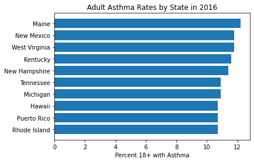

# Exploring and Transforming JSON Schemas - Lab

# Introduction

In this lab, you'll practice exploring a JSON file whose structure and schema is unknown to you. We will provide you with limited information, and you will explore the dataset to answer the specified question.

## Objectives
You will be able to:
* Use the JSON module to load and parse JSON documents
* Explore and extract data using unknown JSON schemas
* Convert JSON to a pandas dataframe

## Your Task: Create a Bar Graph of the Top 10 States with the Highest Asthma Rates for Adults Age 18+

The information you need to create this graph is located in `disease_data.json`. It contains both data and metadata.

You are given the following codebook/data dictionary:

* The actual data values are associated with the key `'DataValue'`
* The state names are associated with the key `'LocationDesc'`
* To filter to the appropriate records, make sure:
  * The `'Question'` is `'Current asthma prevalence among adults aged >= 18 years'`
  * The `'StratificationCategoryID1'` is `'OVERALL'`
  * The `'DataValueTypeID'` is `'CRDPREV'`
  * The `'LocationDesc'` is not `'United States'`
  
The provided JSON file contains both data and metadata, and you will need to parse the metadata in order to understand the meanings of the values in the data.

No further information about the structure of this file is provided.

## Load the JSON File

Load the data from the file `disease_data.json` into a variable `data`.


```python
import json
with open('disease_data.json') as f:
    data = json.load(f)
```

## Explore the Overall Structure

What is the overall data type of `data`?


```python
# Check type of master [root] data container
type(data)
```


    dict


What are the keys?


```python
# Further details
data.keys()
```


    dict_keys(['meta', 'data'])


What are the data types associates with those keys?


```python
# Looking at the data
type(data['data'])
```


    list


```python
# Looking at the metadata
type(data['meta'])
```


    dict


Perform additional exploration to understand the contents of these values. For dictionaries, what are their keys? For lists, what is the length, and what does the first element look like?


```python
# Further details on data
print("Length of data list:", len(data['data']))
print("First element of data list:")
print(data['data'][0])
```

    Length of data list: 60266
    First element of data list:
    [1, 'FF49C41F-CE8D-46C4-9164-653B1227CF6F', 1, 1527194521, '959778', 1527194521, '959778', None, '2016', '2016', 'US', 'United States', 'BRFSS', 'Alcohol', 'Binge drinking prevalence among adults aged >= 18 years', None, '%', 'Crude Prevalence', '16.9', '16.9', '*', '50 States + DC: US Median', '16', '18', 'Overall', 'Overall', None, None, None, None, [None, None, None, None, None], None, '59', 'ALC', 'ALC2_2', 'CRDPREV', 'OVERALL', 'OVR', None, None, None, None]


```python
# Further details on metadata
data['meta'].keys()
```


    dict_keys(['view'])


```python
# Ok, one level deeper on metadata
type(data['meta']['view'])
```


    dict


```python
# What are the keys of the metadata?
data['meta']['view'].keys()
```


    dict_keys(['id', 'name', 'attribution', 'attributionLink', 'averageRating', 'category', 'createdAt', 'description', 'displayType', 'downloadCount', 'hideFromCatalog', 'hideFromDataJson', 'indexUpdatedAt', 'licenseId', 'newBackend', 'numberOfComments', 'oid', 'provenance', 'publicationAppendEnabled', 'publicationDate', 'publicationGroup', 'publicationStage', 'rowClass', 'rowsUpdatedAt', 'rowsUpdatedBy', 'tableId', 'totalTimesRated', 'viewCount', 'viewLastModified', 'viewType', 'columns', 'grants', 'license', 'metadata', 'owner', 'query', 'rights', 'tableAuthor', 'tags', 'flags'])


As you likely identified, we have a list of lists forming the `'data'`. In order to make sense of that list of lists, we need to find the meaning of each index, i.e. the names of the columns.

## Identify the Column Names

Look through the metadata to find the *names* of the columns, and assign that variable to `column_names`. This should be a list of strings. (If you just get the values associated with the `'columns'` key, you will have a list of dictionaries, not a list of strings.)


```python
# We notice a key 'columns' in the metadata, let's investigate
data['meta']['view']['columns'][:3]
```


    [{'id': -1,
      'name': 'sid',
      'dataTypeName': 'meta_data',
      'fieldName': ':sid',
      'position': 0,
      'renderTypeName': 'meta_data',
      'format': {},
      'flags': ['hidden']},
     {'id': -1,
      'name': 'id',
      'dataTypeName': 'meta_data',
      'fieldName': ':id',
      'position': 0,
      'renderTypeName': 'meta_data',
      'format': {},
      'flags': ['hidden']},
     {'id': -1,
      'name': 'position',
      'dataTypeName': 'meta_data',
      'fieldName': ':position',
      'position': 0,
      'renderTypeName': 'meta_data',
      'format': {},
      'flags': ['hidden']}]


```python
# Ok, list of dictionaries, each has a 'name' key
column_names = [column['name'] for column in data['meta']['view']['columns']]
print(column_names)
```

    ['sid', 'id', 'position', 'created_at', 'created_meta', 'updated_at', 'updated_meta', 'meta', 'YearStart', 'YearEnd', 'LocationAbbr', 'LocationDesc', 'DataSource', 'Topic', 'Question', 'Response', 'DataValueUnit', 'DataValueType', 'DataValue', 'DataValueAlt', 'DataValueFootnoteSymbol', 'DatavalueFootnote', 'LowConfidenceLimit', 'HighConfidenceLimit', 'StratificationCategory1', 'Stratification1', 'StratificationCategory2', 'Stratification2', 'StratificationCategory3', 'Stratification3', 'GeoLocation', 'ResponseID', 'LocationID', 'TopicID', 'QuestionID', 'DataValueTypeID', 'StratificationCategoryID1', 'StratificationID1', 'StratificationCategoryID2', 'StratificationID2', 'StratificationCategoryID3', 'StratificationID3']


The following code checks that you have the correct column names:


```python

# 42 total columns
assert len(column_names) == 42

# Each name should be a string, not a dict
assert type(column_names[0]) == str and type(column_names[-1]) == str

# Check that we have some specific strings
assert "DataValue" in column_names
assert "LocationDesc" in column_names
assert "Question" in column_names
assert "StratificationCategoryID1" in column_names
assert "DataValueTypeID" in column_names
```

## Filter Rows Based on Columns

Recall that we only want to include records where:

* The `'Question'` is `'Current asthma prevalence among adults aged >= 18 years'`
* The `'StratificationCategoryID1'` is `'OVERALL'`
* The `'DataValueTypeID'` is `'CRDPREV'`
* The `'LocationDesc'` is not `'United States'`

Combining knowledge of the data and metadata, filter out the rows of data that are not relevant.

(You may find the `pandas` library useful here.)


```python
# Reminding ourselves what a record looks like
print(data['data'][0])
```

    [1, 'FF49C41F-CE8D-46C4-9164-653B1227CF6F', 1, 1527194521, '959778', 1527194521, '959778', None, '2016', '2016', 'US', 'United States', 'BRFSS', 'Alcohol', 'Binge drinking prevalence among adults aged >= 18 years', None, '%', 'Crude Prevalence', '16.9', '16.9', '*', '50 States + DC: US Median', '16', '18', 'Overall', 'Overall', None, None, None, None, [None, None, None, None, None], None, '59', 'ALC', 'ALC2_2', 'CRDPREV', 'OVERALL', 'OVR', None, None, None, None]


```python

# Transcribing the columns we are filtering based on
question_name = "Question"
category_name = "StratificationCategoryID1"
type_name = "DataValueTypeID"
location_name = "LocationDesc"

# Transcribing the values we are filtering for
question_value = "Current asthma prevalence among adults aged >= 18 years"
category_value = "OVERALL"
type_value = "CRDPREV"
location_value = "United States"
```


```python

# First, a solution without pandas

# Locate indices of relevant columns
question_index = column_names.index(question_name)
category_index = column_names.index(category_name)
type_index = column_names.index(type_name)
location_index = column_names.index(location_name)

relevant_records_without_pandas = []
for record in data['data']:
    # Note most are == except for location, which specified NOT
    if record[question_index] == question_value and \
        record[category_index] == category_value and \
        record[type_index] == type_value and \
        record[location_index] != location_value:
            relevant_records_without_pandas.append(record)

# Information about the results
print(len(relevant_records_without_pandas), "relevant records found")
print("First record:")
print(relevant_records_without_pandas[0])
```

    54 relevant records found
    First record:
    [9369, '6BEC61D0-E04B-44BA-8170-F7D6A4C40A09', 9369, 1527194523, '959778', 1527194523, '959778', None, '2016', '2016', 'AL', 'Alabama', 'BRFSS', 'Asthma', 'Current asthma prevalence among adults aged >= 18 years', None, '%', 'Crude Prevalence', '9.7', '9.7', None, None, '8.8', '10.7', 'Overall', 'Overall', None, None, None, None, [None, '32.84057112200048', '-86.63186076199969', None, False], None, '01', 'AST', 'AST1_1', 'CRDPREV', 'OVERALL', 'OVR', None, None, None, None]


```python

# Then, a soluton with pandas

# Start by making a dataframe using the data
import pandas as pd

df = pd.DataFrame(data=data['data'], columns=column_names)
df
```


<div>
<style scoped>
    .dataframe tbody tr th:only-of-type {
        vertical-align: middle;
    }

    .dataframe tbody tr th {
        vertical-align: top;
    }

    .dataframe thead th {
        text-align: right;
    }
</style>
<table border="1" class="dataframe">
  <thead>
    <tr style="text-align: right;">
      <th></th>
      <th>sid</th>
      <th>id</th>
      <th>position</th>
      <th>created_at</th>
      <th>created_meta</th>
      <th>updated_at</th>
      <th>updated_meta</th>
      <th>meta</th>
      <th>YearStart</th>
      <th>YearEnd</th>
      <th>...</th>
      <th>LocationID</th>
      <th>TopicID</th>
      <th>QuestionID</th>
      <th>DataValueTypeID</th>
      <th>StratificationCategoryID1</th>
      <th>StratificationID1</th>
      <th>StratificationCategoryID2</th>
      <th>StratificationID2</th>
      <th>StratificationCategoryID3</th>
      <th>StratificationID3</th>
    </tr>
  </thead>
  <tbody>
    <tr>
      <th>0</th>
      <td>1</td>
      <td>FF49C41F-CE8D-46C4-9164-653B1227CF6F</td>
      <td>1</td>
      <td>1527194521</td>
      <td>959778</td>
      <td>1527194521</td>
      <td>959778</td>
      <td>None</td>
      <td>2016</td>
      <td>2016</td>
      <td>...</td>
      <td>59</td>
      <td>ALC</td>
      <td>ALC2_2</td>
      <td>CRDPREV</td>
      <td>OVERALL</td>
      <td>OVR</td>
      <td>None</td>
      <td>None</td>
      <td>None</td>
      <td>None</td>
    </tr>
    <tr>
      <th>1</th>
      <td>2</td>
      <td>F4468C3D-340A-4CD2-84A3-DF554DFF065E</td>
      <td>2</td>
      <td>1527194521</td>
      <td>959778</td>
      <td>1527194521</td>
      <td>959778</td>
      <td>None</td>
      <td>2016</td>
      <td>2016</td>
      <td>...</td>
      <td>01</td>
      <td>ALC</td>
      <td>ALC2_2</td>
      <td>CRDPREV</td>
      <td>OVERALL</td>
      <td>OVR</td>
      <td>None</td>
      <td>None</td>
      <td>None</td>
      <td>None</td>
    </tr>
    <tr>
      <th>2</th>
      <td>3</td>
      <td>65609156-A343-4869-B03F-2BA62E96AC19</td>
      <td>3</td>
      <td>1527194521</td>
      <td>959778</td>
      <td>1527194521</td>
      <td>959778</td>
      <td>None</td>
      <td>2016</td>
      <td>2016</td>
      <td>...</td>
      <td>02</td>
      <td>ALC</td>
      <td>ALC2_2</td>
      <td>CRDPREV</td>
      <td>OVERALL</td>
      <td>OVR</td>
      <td>None</td>
      <td>None</td>
      <td>None</td>
      <td>None</td>
    </tr>
    <tr>
      <th>3</th>
      <td>4</td>
      <td>0DB09B00-EFEB-4AC0-9467-A7CBD2B57BF3</td>
      <td>4</td>
      <td>1527194521</td>
      <td>959778</td>
      <td>1527194521</td>
      <td>959778</td>
      <td>None</td>
      <td>2016</td>
      <td>2016</td>
      <td>...</td>
      <td>04</td>
      <td>ALC</td>
      <td>ALC2_2</td>
      <td>CRDPREV</td>
      <td>OVERALL</td>
      <td>OVR</td>
      <td>None</td>
      <td>None</td>
      <td>None</td>
      <td>None</td>
    </tr>
    <tr>
      <th>4</th>
      <td>5</td>
      <td>D98DA5BA-6FD6-40F5-A9B1-ABD45E44967B</td>
      <td>5</td>
      <td>1527194521</td>
      <td>959778</td>
      <td>1527194521</td>
      <td>959778</td>
      <td>None</td>
      <td>2016</td>
      <td>2016</td>
      <td>...</td>
      <td>05</td>
      <td>ALC</td>
      <td>ALC2_2</td>
      <td>CRDPREV</td>
      <td>OVERALL</td>
      <td>OVR</td>
      <td>None</td>
      <td>None</td>
      <td>None</td>
      <td>None</td>
    </tr>
    <tr>
      <th>...</th>
      <td>...</td>
      <td>...</td>
      <td>...</td>
      <td>...</td>
      <td>...</td>
      <td>...</td>
      <td>...</td>
      <td>...</td>
      <td>...</td>
      <td>...</td>
      <td>...</td>
      <td>...</td>
      <td>...</td>
      <td>...</td>
      <td>...</td>
      <td>...</td>
      <td>...</td>
      <td>...</td>
      <td>...</td>
      <td>...</td>
      <td>...</td>
    </tr>
    <tr>
      <th>60261</th>
      <td>519150</td>
      <td>1B28C1DD-B25F-457E-86E4-7D1463BE82C3</td>
      <td>519150</td>
      <td>1527194644</td>
      <td>959778</td>
      <td>1527194644</td>
      <td>959778</td>
      <td>None</td>
      <td>2016</td>
      <td>2016</td>
      <td>...</td>
      <td>72</td>
      <td>DIS</td>
      <td>DIS1_0</td>
      <td>CRDPREV</td>
      <td>RACE</td>
      <td>ASN</td>
      <td>None</td>
      <td>None</td>
      <td>None</td>
      <td>None</td>
    </tr>
    <tr>
      <th>60262</th>
      <td>519704</td>
      <td>4FF6ADF8-CC4B-4D94-A5B0-7766346A0D3E</td>
      <td>519704</td>
      <td>1527194644</td>
      <td>959778</td>
      <td>1527194644</td>
      <td>959778</td>
      <td>None</td>
      <td>2016</td>
      <td>2016</td>
      <td>...</td>
      <td>72</td>
      <td>OVC</td>
      <td>OVC3_1</td>
      <td>CRDPREV</td>
      <td>RACE</td>
      <td>BLK</td>
      <td>None</td>
      <td>None</td>
      <td>None</td>
      <td>None</td>
    </tr>
    <tr>
      <th>60263</th>
      <td>519705</td>
      <td>02896705-4A9F-45A2-A84B-923DEA6DC6A2</td>
      <td>519705</td>
      <td>1527194644</td>
      <td>959778</td>
      <td>1527194644</td>
      <td>959778</td>
      <td>None</td>
      <td>2016</td>
      <td>2016</td>
      <td>...</td>
      <td>72</td>
      <td>OVC</td>
      <td>OVC3_1</td>
      <td>CRDPREV</td>
      <td>RACE</td>
      <td>AIAN</td>
      <td>None</td>
      <td>None</td>
      <td>None</td>
      <td>None</td>
    </tr>
    <tr>
      <th>60264</th>
      <td>519706</td>
      <td>4DF2E74C-5043-474B-9739-98B4D8736BDB</td>
      <td>519706</td>
      <td>1527194644</td>
      <td>959778</td>
      <td>1527194644</td>
      <td>959778</td>
      <td>None</td>
      <td>2016</td>
      <td>2016</td>
      <td>...</td>
      <td>72</td>
      <td>OVC</td>
      <td>OVC3_1</td>
      <td>CRDPREV</td>
      <td>RACE</td>
      <td>ASN</td>
      <td>None</td>
      <td>None</td>
      <td>None</td>
      <td>None</td>
    </tr>
    <tr>
      <th>60265</th>
      <td>519707</td>
      <td>D742712D-EAFE-401B-83BB-AB93F597E907</td>
      <td>519707</td>
      <td>1527194644</td>
      <td>959778</td>
      <td>1527194644</td>
      <td>959778</td>
      <td>None</td>
      <td>2016</td>
      <td>2016</td>
      <td>...</td>
      <td>72</td>
      <td>OVC</td>
      <td>OVC3_1</td>
      <td>CRDPREV</td>
      <td>RACE</td>
      <td>WHT</td>
      <td>None</td>
      <td>None</td>
      <td>None</td>
      <td>None</td>
    </tr>
  </tbody>
</table>
<p>60266 rows × 42 columns</p>
</div>


```python

# Filtering the dataframe based on the criteria

relevant_records_with_pandas = df[
    (df[question_name] == question_value) &
    (df[category_name] == category_value) &
    (df[type_name] == type_value) &
    (df[location_name] != location_value)
]

relevant_records_with_pandas
```


<div>
<style scoped>
    .dataframe tbody tr th:only-of-type {
        vertical-align: middle;
    }

    .dataframe tbody tr th {
        vertical-align: top;
    }

    .dataframe thead th {
        text-align: right;
    }
</style>
<table border="1" class="dataframe">
  <thead>
    <tr style="text-align: right;">
      <th></th>
      <th>sid</th>
      <th>id</th>
      <th>position</th>
      <th>created_at</th>
      <th>created_meta</th>
      <th>updated_at</th>
      <th>updated_meta</th>
      <th>meta</th>
      <th>YearStart</th>
      <th>YearEnd</th>
      <th>...</th>
      <th>LocationID</th>
      <th>TopicID</th>
      <th>QuestionID</th>
      <th>DataValueTypeID</th>
      <th>StratificationCategoryID1</th>
      <th>StratificationID1</th>
      <th>StratificationCategoryID2</th>
      <th>StratificationID2</th>
      <th>StratificationCategoryID3</th>
      <th>StratificationID3</th>
    </tr>
  </thead>
  <tbody>
    <tr>
      <th>9371</th>
      <td>9369</td>
      <td>6BEC61D0-E04B-44BA-8170-F7D6A4C40A09</td>
      <td>9369</td>
      <td>1527194523</td>
      <td>959778</td>
      <td>1527194523</td>
      <td>959778</td>
      <td>None</td>
      <td>2016</td>
      <td>2016</td>
      <td>...</td>
      <td>01</td>
      <td>AST</td>
      <td>AST1_1</td>
      <td>CRDPREV</td>
      <td>OVERALL</td>
      <td>OVR</td>
      <td>None</td>
      <td>None</td>
      <td>None</td>
      <td>None</td>
    </tr>
    <tr>
      <th>9372</th>
      <td>9370</td>
      <td>5D6EDDA9-B241-4498-A262-ED20AB78C44C</td>
      <td>9370</td>
      <td>1527194523</td>
      <td>959778</td>
      <td>1527194523</td>
      <td>959778</td>
      <td>None</td>
      <td>2016</td>
      <td>2016</td>
      <td>...</td>
      <td>02</td>
      <td>AST</td>
      <td>AST1_1</td>
      <td>CRDPREV</td>
      <td>OVERALL</td>
      <td>OVR</td>
      <td>None</td>
      <td>None</td>
      <td>None</td>
      <td>None</td>
    </tr>
    <tr>
      <th>9373</th>
      <td>9371</td>
      <td>5FCE0D49-11FD-4545-B9E7-14F503123105</td>
      <td>9371</td>
      <td>1527194523</td>
      <td>959778</td>
      <td>1527194523</td>
      <td>959778</td>
      <td>None</td>
      <td>2016</td>
      <td>2016</td>
      <td>...</td>
      <td>04</td>
      <td>AST</td>
      <td>AST1_1</td>
      <td>CRDPREV</td>
      <td>OVERALL</td>
      <td>OVR</td>
      <td>None</td>
      <td>None</td>
      <td>None</td>
      <td>None</td>
    </tr>
    <tr>
      <th>9374</th>
      <td>9372</td>
      <td>68F151CE-3084-402C-B672-78A43FBDE287</td>
      <td>9372</td>
      <td>1527194523</td>
      <td>959778</td>
      <td>1527194523</td>
      <td>959778</td>
      <td>None</td>
      <td>2016</td>
      <td>2016</td>
      <td>...</td>
      <td>05</td>
      <td>AST</td>
      <td>AST1_1</td>
      <td>CRDPREV</td>
      <td>OVERALL</td>
      <td>OVR</td>
      <td>None</td>
      <td>None</td>
      <td>None</td>
      <td>None</td>
    </tr>
    <tr>
      <th>9375</th>
      <td>9373</td>
      <td>D3F00ED2-A069-4E40-B42B-5A2528A91B6F</td>
      <td>9373</td>
      <td>1527194523</td>
      <td>959778</td>
      <td>1527194523</td>
      <td>959778</td>
      <td>None</td>
      <td>2016</td>
      <td>2016</td>
      <td>...</td>
      <td>06</td>
      <td>AST</td>
      <td>AST1_1</td>
      <td>CRDPREV</td>
      <td>OVERALL</td>
      <td>OVR</td>
      <td>None</td>
      <td>None</td>
      <td>None</td>
      <td>None</td>
    </tr>
    <tr>
      <th>9376</th>
      <td>9374</td>
      <td>A8B4F198-D388-4663-B82B-936C5FB37428</td>
      <td>9374</td>
      <td>1527194523</td>
      <td>959778</td>
      <td>1527194523</td>
      <td>959778</td>
      <td>None</td>
      <td>2016</td>
      <td>2016</td>
      <td>...</td>
      <td>08</td>
      <td>AST</td>
      <td>AST1_1</td>
      <td>CRDPREV</td>
      <td>OVERALL</td>
      <td>OVR</td>
      <td>None</td>
      <td>None</td>
      <td>None</td>
      <td>None</td>
    </tr>
    <tr>
      <th>9377</th>
      <td>9375</td>
      <td>B2FB1AEA-5E2A-4E7C-9A93-586EA18EBE99</td>
      <td>9375</td>
      <td>1527194523</td>
      <td>959778</td>
      <td>1527194523</td>
      <td>959778</td>
      <td>None</td>
      <td>2016</td>
      <td>2016</td>
      <td>...</td>
      <td>09</td>
      <td>AST</td>
      <td>AST1_1</td>
      <td>CRDPREV</td>
      <td>OVERALL</td>
      <td>OVR</td>
      <td>None</td>
      <td>None</td>
      <td>None</td>
      <td>None</td>
    </tr>
    <tr>
      <th>9378</th>
      <td>9376</td>
      <td>7C5D70DE-DE95-4AAD-A666-2260B5A16363</td>
      <td>9376</td>
      <td>1527194523</td>
      <td>959778</td>
      <td>1527194523</td>
      <td>959778</td>
      <td>None</td>
      <td>2016</td>
      <td>2016</td>
      <td>...</td>
      <td>10</td>
      <td>AST</td>
      <td>AST1_1</td>
      <td>CRDPREV</td>
      <td>OVERALL</td>
      <td>OVR</td>
      <td>None</td>
      <td>None</td>
      <td>None</td>
      <td>None</td>
    </tr>
    <tr>
      <th>9379</th>
      <td>9377</td>
      <td>1893C9A3-C6CE-4F47-A66F-85A4F89F244F</td>
      <td>9377</td>
      <td>1527194523</td>
      <td>959778</td>
      <td>1527194523</td>
      <td>959778</td>
      <td>None</td>
      <td>2016</td>
      <td>2016</td>
      <td>...</td>
      <td>11</td>
      <td>AST</td>
      <td>AST1_1</td>
      <td>CRDPREV</td>
      <td>OVERALL</td>
      <td>OVR</td>
      <td>None</td>
      <td>None</td>
      <td>None</td>
      <td>None</td>
    </tr>
    <tr>
      <th>9380</th>
      <td>9378</td>
      <td>D47614E3-47D4-40D6-AC29-C434C876F3DF</td>
      <td>9378</td>
      <td>1527194523</td>
      <td>959778</td>
      <td>1527194523</td>
      <td>959778</td>
      <td>None</td>
      <td>2016</td>
      <td>2016</td>
      <td>...</td>
      <td>12</td>
      <td>AST</td>
      <td>AST1_1</td>
      <td>CRDPREV</td>
      <td>OVERALL</td>
      <td>OVR</td>
      <td>None</td>
      <td>None</td>
      <td>None</td>
      <td>None</td>
    </tr>
    <tr>
      <th>9381</th>
      <td>9379</td>
      <td>B1F090FC-1E46-467C-8C7D-0B90022A36BB</td>
      <td>9379</td>
      <td>1527194523</td>
      <td>959778</td>
      <td>1527194523</td>
      <td>959778</td>
      <td>None</td>
      <td>2016</td>
      <td>2016</td>
      <td>...</td>
      <td>13</td>
      <td>AST</td>
      <td>AST1_1</td>
      <td>CRDPREV</td>
      <td>OVERALL</td>
      <td>OVR</td>
      <td>None</td>
      <td>None</td>
      <td>None</td>
      <td>None</td>
    </tr>
    <tr>
      <th>9382</th>
      <td>9380</td>
      <td>BFF73DC1-4B7B-43AC-9797-5F244999B94A</td>
      <td>9380</td>
      <td>1527194523</td>
      <td>959778</td>
      <td>1527194523</td>
      <td>959778</td>
      <td>None</td>
      <td>2016</td>
      <td>2016</td>
      <td>...</td>
      <td>15</td>
      <td>AST</td>
      <td>AST1_1</td>
      <td>CRDPREV</td>
      <td>OVERALL</td>
      <td>OVR</td>
      <td>None</td>
      <td>None</td>
      <td>None</td>
      <td>None</td>
    </tr>
    <tr>
      <th>9383</th>
      <td>9381</td>
      <td>35433725-2434-480F-8DA5-7D74D3CE9A5B</td>
      <td>9381</td>
      <td>1527194523</td>
      <td>959778</td>
      <td>1527194523</td>
      <td>959778</td>
      <td>None</td>
      <td>2016</td>
      <td>2016</td>
      <td>...</td>
      <td>16</td>
      <td>AST</td>
      <td>AST1_1</td>
      <td>CRDPREV</td>
      <td>OVERALL</td>
      <td>OVR</td>
      <td>None</td>
      <td>None</td>
      <td>None</td>
      <td>None</td>
    </tr>
    <tr>
      <th>9384</th>
      <td>9382</td>
      <td>8EE36428-84FF-44DA-BABA-86836A3A6E47</td>
      <td>9382</td>
      <td>1527194523</td>
      <td>959778</td>
      <td>1527194523</td>
      <td>959778</td>
      <td>None</td>
      <td>2016</td>
      <td>2016</td>
      <td>...</td>
      <td>17</td>
      <td>AST</td>
      <td>AST1_1</td>
      <td>CRDPREV</td>
      <td>OVERALL</td>
      <td>OVR</td>
      <td>None</td>
      <td>None</td>
      <td>None</td>
      <td>None</td>
    </tr>
    <tr>
      <th>9385</th>
      <td>9383</td>
      <td>992D61D5-06F9-4001-AA9B-0F9CE29E001C</td>
      <td>9383</td>
      <td>1527194523</td>
      <td>959778</td>
      <td>1527194523</td>
      <td>959778</td>
      <td>None</td>
      <td>2016</td>
      <td>2016</td>
      <td>...</td>
      <td>18</td>
      <td>AST</td>
      <td>AST1_1</td>
      <td>CRDPREV</td>
      <td>OVERALL</td>
      <td>OVR</td>
      <td>None</td>
      <td>None</td>
      <td>None</td>
      <td>None</td>
    </tr>
    <tr>
      <th>9386</th>
      <td>9384</td>
      <td>5CC74C63-269D-4037-93EB-3048D5401548</td>
      <td>9384</td>
      <td>1527194523</td>
      <td>959778</td>
      <td>1527194523</td>
      <td>959778</td>
      <td>None</td>
      <td>2016</td>
      <td>2016</td>
      <td>...</td>
      <td>19</td>
      <td>AST</td>
      <td>AST1_1</td>
      <td>CRDPREV</td>
      <td>OVERALL</td>
      <td>OVR</td>
      <td>None</td>
      <td>None</td>
      <td>None</td>
      <td>None</td>
    </tr>
    <tr>
      <th>9387</th>
      <td>9385</td>
      <td>49F933C4-2A17-4F75-B791-526573D3D99F</td>
      <td>9385</td>
      <td>1527194523</td>
      <td>959778</td>
      <td>1527194523</td>
      <td>959778</td>
      <td>None</td>
      <td>2016</td>
      <td>2016</td>
      <td>...</td>
      <td>20</td>
      <td>AST</td>
      <td>AST1_1</td>
      <td>CRDPREV</td>
      <td>OVERALL</td>
      <td>OVR</td>
      <td>None</td>
      <td>None</td>
      <td>None</td>
      <td>None</td>
    </tr>
    <tr>
      <th>9388</th>
      <td>9386</td>
      <td>521713DD-8FF1-4232-8608-EA12E8007A4D</td>
      <td>9386</td>
      <td>1527194523</td>
      <td>959778</td>
      <td>1527194523</td>
      <td>959778</td>
      <td>None</td>
      <td>2016</td>
      <td>2016</td>
      <td>...</td>
      <td>21</td>
      <td>AST</td>
      <td>AST1_1</td>
      <td>CRDPREV</td>
      <td>OVERALL</td>
      <td>OVR</td>
      <td>None</td>
      <td>None</td>
      <td>None</td>
      <td>None</td>
    </tr>
    <tr>
      <th>9389</th>
      <td>9387</td>
      <td>55EB767F-A700-4E21-93D4-0749ABA918DC</td>
      <td>9387</td>
      <td>1527194523</td>
      <td>959778</td>
      <td>1527194523</td>
      <td>959778</td>
      <td>None</td>
      <td>2016</td>
      <td>2016</td>
      <td>...</td>
      <td>22</td>
      <td>AST</td>
      <td>AST1_1</td>
      <td>CRDPREV</td>
      <td>OVERALL</td>
      <td>OVR</td>
      <td>None</td>
      <td>None</td>
      <td>None</td>
      <td>None</td>
    </tr>
    <tr>
      <th>9390</th>
      <td>9388</td>
      <td>B39B1D7E-8D3A-4BE0-AC5D-4D499F3F30C7</td>
      <td>9388</td>
      <td>1527194523</td>
      <td>959778</td>
      <td>1527194523</td>
      <td>959778</td>
      <td>None</td>
      <td>2016</td>
      <td>2016</td>
      <td>...</td>
      <td>23</td>
      <td>AST</td>
      <td>AST1_1</td>
      <td>CRDPREV</td>
      <td>OVERALL</td>
      <td>OVR</td>
      <td>None</td>
      <td>None</td>
      <td>None</td>
      <td>None</td>
    </tr>
    <tr>
      <th>9391</th>
      <td>9389</td>
      <td>219420E0-760B-4A02-B0FF-44E9051D34E7</td>
      <td>9389</td>
      <td>1527194523</td>
      <td>959778</td>
      <td>1527194523</td>
      <td>959778</td>
      <td>None</td>
      <td>2016</td>
      <td>2016</td>
      <td>...</td>
      <td>24</td>
      <td>AST</td>
      <td>AST1_1</td>
      <td>CRDPREV</td>
      <td>OVERALL</td>
      <td>OVR</td>
      <td>None</td>
      <td>None</td>
      <td>None</td>
      <td>None</td>
    </tr>
    <tr>
      <th>9392</th>
      <td>9390</td>
      <td>E27F81E2-931C-469B-BE46-805EC12B8196</td>
      <td>9390</td>
      <td>1527194523</td>
      <td>959778</td>
      <td>1527194523</td>
      <td>959778</td>
      <td>None</td>
      <td>2016</td>
      <td>2016</td>
      <td>...</td>
      <td>25</td>
      <td>AST</td>
      <td>AST1_1</td>
      <td>CRDPREV</td>
      <td>OVERALL</td>
      <td>OVR</td>
      <td>None</td>
      <td>None</td>
      <td>None</td>
      <td>None</td>
    </tr>
    <tr>
      <th>9393</th>
      <td>9391</td>
      <td>3481271B-7943-4A2F-9CEE-1EBCE30E5CB6</td>
      <td>9391</td>
      <td>1527194523</td>
      <td>959778</td>
      <td>1527194523</td>
      <td>959778</td>
      <td>None</td>
      <td>2016</td>
      <td>2016</td>
      <td>...</td>
      <td>26</td>
      <td>AST</td>
      <td>AST1_1</td>
      <td>CRDPREV</td>
      <td>OVERALL</td>
      <td>OVR</td>
      <td>None</td>
      <td>None</td>
      <td>None</td>
      <td>None</td>
    </tr>
    <tr>
      <th>9394</th>
      <td>9392</td>
      <td>AC02F97B-445F-40E2-B429-837B256F27E3</td>
      <td>9392</td>
      <td>1527194523</td>
      <td>959778</td>
      <td>1527194523</td>
      <td>959778</td>
      <td>None</td>
      <td>2016</td>
      <td>2016</td>
      <td>...</td>
      <td>27</td>
      <td>AST</td>
      <td>AST1_1</td>
      <td>CRDPREV</td>
      <td>OVERALL</td>
      <td>OVR</td>
      <td>None</td>
      <td>None</td>
      <td>None</td>
      <td>None</td>
    </tr>
    <tr>
      <th>9395</th>
      <td>9393</td>
      <td>17BE97D3-36B0-462C-A798-CFEE2E5C974C</td>
      <td>9393</td>
      <td>1527194523</td>
      <td>959778</td>
      <td>1527194523</td>
      <td>959778</td>
      <td>None</td>
      <td>2016</td>
      <td>2016</td>
      <td>...</td>
      <td>28</td>
      <td>AST</td>
      <td>AST1_1</td>
      <td>CRDPREV</td>
      <td>OVERALL</td>
      <td>OVR</td>
      <td>None</td>
      <td>None</td>
      <td>None</td>
      <td>None</td>
    </tr>
    <tr>
      <th>9396</th>
      <td>9394</td>
      <td>53D09576-C3BE-45F3-AC0D-8A4D1B1484D9</td>
      <td>9394</td>
      <td>1527194523</td>
      <td>959778</td>
      <td>1527194523</td>
      <td>959778</td>
      <td>None</td>
      <td>2016</td>
      <td>2016</td>
      <td>...</td>
      <td>29</td>
      <td>AST</td>
      <td>AST1_1</td>
      <td>CRDPREV</td>
      <td>OVERALL</td>
      <td>OVR</td>
      <td>None</td>
      <td>None</td>
      <td>None</td>
      <td>None</td>
    </tr>
    <tr>
      <th>9397</th>
      <td>9395</td>
      <td>991ACC7D-0ABB-4556-867B-EE4EAA719F0A</td>
      <td>9395</td>
      <td>1527194523</td>
      <td>959778</td>
      <td>1527194523</td>
      <td>959778</td>
      <td>None</td>
      <td>2016</td>
      <td>2016</td>
      <td>...</td>
      <td>30</td>
      <td>AST</td>
      <td>AST1_1</td>
      <td>CRDPREV</td>
      <td>OVERALL</td>
      <td>OVR</td>
      <td>None</td>
      <td>None</td>
      <td>None</td>
      <td>None</td>
    </tr>
    <tr>
      <th>9398</th>
      <td>9396</td>
      <td>AD024790-0CC0-43A8-A72A-51A46B4C2533</td>
      <td>9396</td>
      <td>1527194523</td>
      <td>959778</td>
      <td>1527194523</td>
      <td>959778</td>
      <td>None</td>
      <td>2016</td>
      <td>2016</td>
      <td>...</td>
      <td>31</td>
      <td>AST</td>
      <td>AST1_1</td>
      <td>CRDPREV</td>
      <td>OVERALL</td>
      <td>OVR</td>
      <td>None</td>
      <td>None</td>
      <td>None</td>
      <td>None</td>
    </tr>
    <tr>
      <th>9399</th>
      <td>9397</td>
      <td>C7692B0C-2B96-4ED1-B24F-9130A54FB75C</td>
      <td>9397</td>
      <td>1527194523</td>
      <td>959778</td>
      <td>1527194523</td>
      <td>959778</td>
      <td>None</td>
      <td>2016</td>
      <td>2016</td>
      <td>...</td>
      <td>32</td>
      <td>AST</td>
      <td>AST1_1</td>
      <td>CRDPREV</td>
      <td>OVERALL</td>
      <td>OVR</td>
      <td>None</td>
      <td>None</td>
      <td>None</td>
      <td>None</td>
    </tr>
    <tr>
      <th>9400</th>
      <td>9398</td>
      <td>74FCA8E5-77AB-44A5-91DA-72673AC06AE5</td>
      <td>9398</td>
      <td>1527194523</td>
      <td>959778</td>
      <td>1527194523</td>
      <td>959778</td>
      <td>None</td>
      <td>2016</td>
      <td>2016</td>
      <td>...</td>
      <td>33</td>
      <td>AST</td>
      <td>AST1_1</td>
      <td>CRDPREV</td>
      <td>OVERALL</td>
      <td>OVR</td>
      <td>None</td>
      <td>None</td>
      <td>None</td>
      <td>None</td>
    </tr>
    <tr>
      <th>9401</th>
      <td>9399</td>
      <td>B5808B62-230B-4411-9C32-7EDACF28D282</td>
      <td>9399</td>
      <td>1527194523</td>
      <td>959778</td>
      <td>1527194523</td>
      <td>959778</td>
      <td>None</td>
      <td>2016</td>
      <td>2016</td>
      <td>...</td>
      <td>34</td>
      <td>AST</td>
      <td>AST1_1</td>
      <td>CRDPREV</td>
      <td>OVERALL</td>
      <td>OVR</td>
      <td>None</td>
      <td>None</td>
      <td>None</td>
      <td>None</td>
    </tr>
    <tr>
      <th>9402</th>
      <td>9400</td>
      <td>3A3C8CBF-9390-456F-AC50-288C76E913AF</td>
      <td>9400</td>
      <td>1527194523</td>
      <td>959778</td>
      <td>1527194523</td>
      <td>959778</td>
      <td>None</td>
      <td>2016</td>
      <td>2016</td>
      <td>...</td>
      <td>35</td>
      <td>AST</td>
      <td>AST1_1</td>
      <td>CRDPREV</td>
      <td>OVERALL</td>
      <td>OVR</td>
      <td>None</td>
      <td>None</td>
      <td>None</td>
      <td>None</td>
    </tr>
    <tr>
      <th>9403</th>
      <td>9401</td>
      <td>A9C42246-0D3E-4D4C-BEC5-340F96D6E3DD</td>
      <td>9401</td>
      <td>1527194523</td>
      <td>959778</td>
      <td>1527194523</td>
      <td>959778</td>
      <td>None</td>
      <td>2016</td>
      <td>2016</td>
      <td>...</td>
      <td>36</td>
      <td>AST</td>
      <td>AST1_1</td>
      <td>CRDPREV</td>
      <td>OVERALL</td>
      <td>OVR</td>
      <td>None</td>
      <td>None</td>
      <td>None</td>
      <td>None</td>
    </tr>
    <tr>
      <th>9404</th>
      <td>9402</td>
      <td>F16FC172-EDA8-4EA7-8C98-8A0AD5A4E1A9</td>
      <td>9402</td>
      <td>1527194523</td>
      <td>959778</td>
      <td>1527194523</td>
      <td>959778</td>
      <td>None</td>
      <td>2016</td>
      <td>2016</td>
      <td>...</td>
      <td>37</td>
      <td>AST</td>
      <td>AST1_1</td>
      <td>CRDPREV</td>
      <td>OVERALL</td>
      <td>OVR</td>
      <td>None</td>
      <td>None</td>
      <td>None</td>
      <td>None</td>
    </tr>
    <tr>
      <th>9405</th>
      <td>9403</td>
      <td>82577FD1-022C-450D-9F94-BC0406EB1754</td>
      <td>9403</td>
      <td>1527194523</td>
      <td>959778</td>
      <td>1527194523</td>
      <td>959778</td>
      <td>None</td>
      <td>2016</td>
      <td>2016</td>
      <td>...</td>
      <td>38</td>
      <td>AST</td>
      <td>AST1_1</td>
      <td>CRDPREV</td>
      <td>OVERALL</td>
      <td>OVR</td>
      <td>None</td>
      <td>None</td>
      <td>None</td>
      <td>None</td>
    </tr>
    <tr>
      <th>9406</th>
      <td>9404</td>
      <td>3A409CD0-793D-496F-B057-BCE2190D5DA1</td>
      <td>9404</td>
      <td>1527194523</td>
      <td>959778</td>
      <td>1527194523</td>
      <td>959778</td>
      <td>None</td>
      <td>2016</td>
      <td>2016</td>
      <td>...</td>
      <td>39</td>
      <td>AST</td>
      <td>AST1_1</td>
      <td>CRDPREV</td>
      <td>OVERALL</td>
      <td>OVR</td>
      <td>None</td>
      <td>None</td>
      <td>None</td>
      <td>None</td>
    </tr>
    <tr>
      <th>9407</th>
      <td>9405</td>
      <td>85373C9C-B495-44E9-A059-6A6F4688932E</td>
      <td>9405</td>
      <td>1527194523</td>
      <td>959778</td>
      <td>1527194523</td>
      <td>959778</td>
      <td>None</td>
      <td>2016</td>
      <td>2016</td>
      <td>...</td>
      <td>40</td>
      <td>AST</td>
      <td>AST1_1</td>
      <td>CRDPREV</td>
      <td>OVERALL</td>
      <td>OVR</td>
      <td>None</td>
      <td>None</td>
      <td>None</td>
      <td>None</td>
    </tr>
    <tr>
      <th>9408</th>
      <td>9406</td>
      <td>F635C6E2-87FD-412A-AB1D-CC5C5E68866D</td>
      <td>9406</td>
      <td>1527194523</td>
      <td>959778</td>
      <td>1527194523</td>
      <td>959778</td>
      <td>None</td>
      <td>2016</td>
      <td>2016</td>
      <td>...</td>
      <td>41</td>
      <td>AST</td>
      <td>AST1_1</td>
      <td>CRDPREV</td>
      <td>OVERALL</td>
      <td>OVR</td>
      <td>None</td>
      <td>None</td>
      <td>None</td>
      <td>None</td>
    </tr>
    <tr>
      <th>9409</th>
      <td>9407</td>
      <td>30EA129F-4AEB-4EB6-8D86-4ECD13192D8A</td>
      <td>9407</td>
      <td>1527194523</td>
      <td>959778</td>
      <td>1527194523</td>
      <td>959778</td>
      <td>None</td>
      <td>2016</td>
      <td>2016</td>
      <td>...</td>
      <td>42</td>
      <td>AST</td>
      <td>AST1_1</td>
      <td>CRDPREV</td>
      <td>OVERALL</td>
      <td>OVR</td>
      <td>None</td>
      <td>None</td>
      <td>None</td>
      <td>None</td>
    </tr>
    <tr>
      <th>9410</th>
      <td>9408</td>
      <td>8AF769A0-E6E7-4068-A5C7-AC94C41F5CE2</td>
      <td>9408</td>
      <td>1527194523</td>
      <td>959778</td>
      <td>1527194523</td>
      <td>959778</td>
      <td>None</td>
      <td>2016</td>
      <td>2016</td>
      <td>...</td>
      <td>44</td>
      <td>AST</td>
      <td>AST1_1</td>
      <td>CRDPREV</td>
      <td>OVERALL</td>
      <td>OVR</td>
      <td>None</td>
      <td>None</td>
      <td>None</td>
      <td>None</td>
    </tr>
    <tr>
      <th>9411</th>
      <td>9409</td>
      <td>043707BE-2A59-43E2-B2EA-71490C2B1F61</td>
      <td>9409</td>
      <td>1527194523</td>
      <td>959778</td>
      <td>1527194523</td>
      <td>959778</td>
      <td>None</td>
      <td>2016</td>
      <td>2016</td>
      <td>...</td>
      <td>45</td>
      <td>AST</td>
      <td>AST1_1</td>
      <td>CRDPREV</td>
      <td>OVERALL</td>
      <td>OVR</td>
      <td>None</td>
      <td>None</td>
      <td>None</td>
      <td>None</td>
    </tr>
    <tr>
      <th>9412</th>
      <td>9410</td>
      <td>2DFA337C-DE2C-43D2-9B8A-2CEEDB414B77</td>
      <td>9410</td>
      <td>1527194523</td>
      <td>959778</td>
      <td>1527194523</td>
      <td>959778</td>
      <td>None</td>
      <td>2016</td>
      <td>2016</td>
      <td>...</td>
      <td>46</td>
      <td>AST</td>
      <td>AST1_1</td>
      <td>CRDPREV</td>
      <td>OVERALL</td>
      <td>OVR</td>
      <td>None</td>
      <td>None</td>
      <td>None</td>
      <td>None</td>
    </tr>
    <tr>
      <th>9413</th>
      <td>9411</td>
      <td>3A6C0ED2-AD01-4FB4-98CC-BAAB0567C0DB</td>
      <td>9411</td>
      <td>1527194523</td>
      <td>959778</td>
      <td>1527194523</td>
      <td>959778</td>
      <td>None</td>
      <td>2016</td>
      <td>2016</td>
      <td>...</td>
      <td>47</td>
      <td>AST</td>
      <td>AST1_1</td>
      <td>CRDPREV</td>
      <td>OVERALL</td>
      <td>OVR</td>
      <td>None</td>
      <td>None</td>
      <td>None</td>
      <td>None</td>
    </tr>
    <tr>
      <th>9414</th>
      <td>9412</td>
      <td>DA122508-115D-40D6-B69F-E0A9078ED9FC</td>
      <td>9412</td>
      <td>1527194523</td>
      <td>959778</td>
      <td>1527194523</td>
      <td>959778</td>
      <td>None</td>
      <td>2016</td>
      <td>2016</td>
      <td>...</td>
      <td>48</td>
      <td>AST</td>
      <td>AST1_1</td>
      <td>CRDPREV</td>
      <td>OVERALL</td>
      <td>OVR</td>
      <td>None</td>
      <td>None</td>
      <td>None</td>
      <td>None</td>
    </tr>
    <tr>
      <th>9415</th>
      <td>9413</td>
      <td>5071E1A5-78CA-43AA-8260-4B8668E298F1</td>
      <td>9413</td>
      <td>1527194523</td>
      <td>959778</td>
      <td>1527194523</td>
      <td>959778</td>
      <td>None</td>
      <td>2016</td>
      <td>2016</td>
      <td>...</td>
      <td>49</td>
      <td>AST</td>
      <td>AST1_1</td>
      <td>CRDPREV</td>
      <td>OVERALL</td>
      <td>OVR</td>
      <td>None</td>
      <td>None</td>
      <td>None</td>
      <td>None</td>
    </tr>
    <tr>
      <th>9416</th>
      <td>9414</td>
      <td>D44E78AC-6A3B-49BE-BD06-2BE0BAF32407</td>
      <td>9414</td>
      <td>1527194523</td>
      <td>959778</td>
      <td>1527194523</td>
      <td>959778</td>
      <td>None</td>
      <td>2016</td>
      <td>2016</td>
      <td>...</td>
      <td>50</td>
      <td>AST</td>
      <td>AST1_1</td>
      <td>CRDPREV</td>
      <td>OVERALL</td>
      <td>OVR</td>
      <td>None</td>
      <td>None</td>
      <td>None</td>
      <td>None</td>
    </tr>
    <tr>
      <th>9417</th>
      <td>9415</td>
      <td>3C55B777-A5D7-4647-8F6E-C18AC47DB4BC</td>
      <td>9415</td>
      <td>1527194523</td>
      <td>959778</td>
      <td>1527194523</td>
      <td>959778</td>
      <td>None</td>
      <td>2016</td>
      <td>2016</td>
      <td>...</td>
      <td>51</td>
      <td>AST</td>
      <td>AST1_1</td>
      <td>CRDPREV</td>
      <td>OVERALL</td>
      <td>OVR</td>
      <td>None</td>
      <td>None</td>
      <td>None</td>
      <td>None</td>
    </tr>
    <tr>
      <th>9418</th>
      <td>9416</td>
      <td>64EDA017-2C34-4C67-A393-5D3D22C9658A</td>
      <td>9416</td>
      <td>1527194523</td>
      <td>959778</td>
      <td>1527194523</td>
      <td>959778</td>
      <td>None</td>
      <td>2016</td>
      <td>2016</td>
      <td>...</td>
      <td>53</td>
      <td>AST</td>
      <td>AST1_1</td>
      <td>CRDPREV</td>
      <td>OVERALL</td>
      <td>OVR</td>
      <td>None</td>
      <td>None</td>
      <td>None</td>
      <td>None</td>
    </tr>
    <tr>
      <th>9419</th>
      <td>9417</td>
      <td>08F3DC50-0E08-4FC5-8D4C-C020627D1C0B</td>
      <td>9417</td>
      <td>1527194523</td>
      <td>959778</td>
      <td>1527194523</td>
      <td>959778</td>
      <td>None</td>
      <td>2016</td>
      <td>2016</td>
      <td>...</td>
      <td>54</td>
      <td>AST</td>
      <td>AST1_1</td>
      <td>CRDPREV</td>
      <td>OVERALL</td>
      <td>OVR</td>
      <td>None</td>
      <td>None</td>
      <td>None</td>
      <td>None</td>
    </tr>
    <tr>
      <th>9420</th>
      <td>9418</td>
      <td>676864A9-3305-4524-AE8A-7FA5C29E821B</td>
      <td>9418</td>
      <td>1527194523</td>
      <td>959778</td>
      <td>1527194523</td>
      <td>959778</td>
      <td>None</td>
      <td>2016</td>
      <td>2016</td>
      <td>...</td>
      <td>55</td>
      <td>AST</td>
      <td>AST1_1</td>
      <td>CRDPREV</td>
      <td>OVERALL</td>
      <td>OVR</td>
      <td>None</td>
      <td>None</td>
      <td>None</td>
      <td>None</td>
    </tr>
    <tr>
      <th>9421</th>
      <td>9419</td>
      <td>E2F93B4A-1B4C-4F7D-8C04-5C02C775623D</td>
      <td>9419</td>
      <td>1527194523</td>
      <td>959778</td>
      <td>1527194523</td>
      <td>959778</td>
      <td>None</td>
      <td>2016</td>
      <td>2016</td>
      <td>...</td>
      <td>56</td>
      <td>AST</td>
      <td>AST1_1</td>
      <td>CRDPREV</td>
      <td>OVERALL</td>
      <td>OVR</td>
      <td>None</td>
      <td>None</td>
      <td>None</td>
      <td>None</td>
    </tr>
    <tr>
      <th>9422</th>
      <td>9420</td>
      <td>F54F90BC-FE44-4506-80B5-BE61F945B5FC</td>
      <td>9420</td>
      <td>1527194523</td>
      <td>959778</td>
      <td>1527194523</td>
      <td>959778</td>
      <td>None</td>
      <td>2016</td>
      <td>2016</td>
      <td>...</td>
      <td>66</td>
      <td>AST</td>
      <td>AST1_1</td>
      <td>CRDPREV</td>
      <td>OVERALL</td>
      <td>OVR</td>
      <td>None</td>
      <td>None</td>
      <td>None</td>
      <td>None</td>
    </tr>
    <tr>
      <th>9423</th>
      <td>9421</td>
      <td>414E8E7D-A3EA-4E3F-81E0-78FCEFCC00BB</td>
      <td>9421</td>
      <td>1527194523</td>
      <td>959778</td>
      <td>1527194523</td>
      <td>959778</td>
      <td>None</td>
      <td>2016</td>
      <td>2016</td>
      <td>...</td>
      <td>72</td>
      <td>AST</td>
      <td>AST1_1</td>
      <td>CRDPREV</td>
      <td>OVERALL</td>
      <td>OVR</td>
      <td>None</td>
      <td>None</td>
      <td>None</td>
      <td>None</td>
    </tr>
    <tr>
      <th>9424</th>
      <td>9422</td>
      <td>89C1CB3A-E017-42CD-8A60-48F7365972F0</td>
      <td>9422</td>
      <td>1527194523</td>
      <td>959778</td>
      <td>1527194523</td>
      <td>959778</td>
      <td>None</td>
      <td>2016</td>
      <td>2016</td>
      <td>...</td>
      <td>78</td>
      <td>AST</td>
      <td>AST1_1</td>
      <td>CRDPREV</td>
      <td>OVERALL</td>
      <td>OVR</td>
      <td>None</td>
      <td>None</td>
      <td>None</td>
      <td>None</td>
    </tr>
  </tbody>
</table>
<p>54 rows × 42 columns</p>
</div>


You should have 54 records after filtering.

## Extract the Attributes Required for Plotting

For each record, the only information we actually need for the graph is the `'DataValue'` and `'LocationDesc'`. Create a list of records that only contains these two attributes.

Also, make sure that the data values are numbers, not strings.


```python

# Version without pandas

data_index = column_names.index("DataValue")

data_and_location_without_pandas = [
    [float(r[data_index]), r[location_index]] for r in relevant_records_without_pandas
]

print(data_and_location_without_pandas)
```

    [[9.7, 'Alabama'], [8.8, 'Alaska'], [9.4, 'Arizona'], [8.5, 'Arkansas'], [7.8, 'California'], [8.8, 'Colorado'], [10.5, 'Connecticut'], [8.5, 'Delaware'], [9.8, 'District of Columbia'], [6.7, 'Florida'], [8.5, 'Georgia'], [10.7, 'Hawaii'], [9.3, 'Idaho'], [8.9, 'Illinois'], [10.2, 'Indiana'], [7.8, 'Iowa'], [8.8, 'Kansas'], [11.6, 'Kentucky'], [8.3, 'Louisiana'], [12.2, 'Maine'], [9.4, 'Maryland'], [10.3, 'Massachusetts'], [10.9, 'Michigan'], [7.6, 'Minnesota'], [8.0, 'Mississippi'], [9.9, 'Missouri'], [8.5, 'Montana'], [8.3, 'Nebraska'], [7.9, 'Nevada'], [11.4, 'New Hampshire'], [8.2, 'New Jersey'], [11.8, 'New Mexico'], [9.5, 'New York'], [8.0, 'North Carolina'], [9.0, 'North Dakota'], [9.7, 'Ohio'], [10.0, 'Oklahoma'], [10.5, 'Oregon'], [10.6, 'Pennsylvania'], [10.7, 'Rhode Island'], [8.8, 'South Carolina'], [6.2, 'South Dakota'], [10.9, 'Tennessee'], [7.6, 'Texas'], [8.2, 'Utah'], [10.2, 'Vermont'], [8.6, 'Virginia'], [9.6, 'Washington'], [11.8, 'West Virginia'], [8.5, 'Wisconsin'], [9.5, 'Wyoming'], [5.1, 'Guam'], [10.7, 'Puerto Rico'], [6.3, 'Virgin Islands']]


```python

# Version with pandas

data_and_location_with_pandas = relevant_records_with_pandas[["DataValue", "LocationDesc"]].copy()
data_and_location_with_pandas["DataValue"] = data_and_location_with_pandas["DataValue"].apply(float)
data_and_location_with_pandas
```


<div>
<style scoped>
    .dataframe tbody tr th:only-of-type {
        vertical-align: middle;
    }

    .dataframe tbody tr th {
        vertical-align: top;
    }

    .dataframe thead th {
        text-align: right;
    }
</style>
<table border="1" class="dataframe">
  <thead>
    <tr style="text-align: right;">
      <th></th>
      <th>DataValue</th>
      <th>LocationDesc</th>
    </tr>
  </thead>
  <tbody>
    <tr>
      <th>9371</th>
      <td>9.7</td>
      <td>Alabama</td>
    </tr>
    <tr>
      <th>9372</th>
      <td>8.8</td>
      <td>Alaska</td>
    </tr>
    <tr>
      <th>9373</th>
      <td>9.4</td>
      <td>Arizona</td>
    </tr>
    <tr>
      <th>9374</th>
      <td>8.5</td>
      <td>Arkansas</td>
    </tr>
    <tr>
      <th>9375</th>
      <td>7.8</td>
      <td>California</td>
    </tr>
    <tr>
      <th>9376</th>
      <td>8.8</td>
      <td>Colorado</td>
    </tr>
    <tr>
      <th>9377</th>
      <td>10.5</td>
      <td>Connecticut</td>
    </tr>
    <tr>
      <th>9378</th>
      <td>8.5</td>
      <td>Delaware</td>
    </tr>
    <tr>
      <th>9379</th>
      <td>9.8</td>
      <td>District of Columbia</td>
    </tr>
    <tr>
      <th>9380</th>
      <td>6.7</td>
      <td>Florida</td>
    </tr>
    <tr>
      <th>9381</th>
      <td>8.5</td>
      <td>Georgia</td>
    </tr>
    <tr>
      <th>9382</th>
      <td>10.7</td>
      <td>Hawaii</td>
    </tr>
    <tr>
      <th>9383</th>
      <td>9.3</td>
      <td>Idaho</td>
    </tr>
    <tr>
      <th>9384</th>
      <td>8.9</td>
      <td>Illinois</td>
    </tr>
    <tr>
      <th>9385</th>
      <td>10.2</td>
      <td>Indiana</td>
    </tr>
    <tr>
      <th>9386</th>
      <td>7.8</td>
      <td>Iowa</td>
    </tr>
    <tr>
      <th>9387</th>
      <td>8.8</td>
      <td>Kansas</td>
    </tr>
    <tr>
      <th>9388</th>
      <td>11.6</td>
      <td>Kentucky</td>
    </tr>
    <tr>
      <th>9389</th>
      <td>8.3</td>
      <td>Louisiana</td>
    </tr>
    <tr>
      <th>9390</th>
      <td>12.2</td>
      <td>Maine</td>
    </tr>
    <tr>
      <th>9391</th>
      <td>9.4</td>
      <td>Maryland</td>
    </tr>
    <tr>
      <th>9392</th>
      <td>10.3</td>
      <td>Massachusetts</td>
    </tr>
    <tr>
      <th>9393</th>
      <td>10.9</td>
      <td>Michigan</td>
    </tr>
    <tr>
      <th>9394</th>
      <td>7.6</td>
      <td>Minnesota</td>
    </tr>
    <tr>
      <th>9395</th>
      <td>8.0</td>
      <td>Mississippi</td>
    </tr>
    <tr>
      <th>9396</th>
      <td>9.9</td>
      <td>Missouri</td>
    </tr>
    <tr>
      <th>9397</th>
      <td>8.5</td>
      <td>Montana</td>
    </tr>
    <tr>
      <th>9398</th>
      <td>8.3</td>
      <td>Nebraska</td>
    </tr>
    <tr>
      <th>9399</th>
      <td>7.9</td>
      <td>Nevada</td>
    </tr>
    <tr>
      <th>9400</th>
      <td>11.4</td>
      <td>New Hampshire</td>
    </tr>
    <tr>
      <th>9401</th>
      <td>8.2</td>
      <td>New Jersey</td>
    </tr>
    <tr>
      <th>9402</th>
      <td>11.8</td>
      <td>New Mexico</td>
    </tr>
    <tr>
      <th>9403</th>
      <td>9.5</td>
      <td>New York</td>
    </tr>
    <tr>
      <th>9404</th>
      <td>8.0</td>
      <td>North Carolina</td>
    </tr>
    <tr>
      <th>9405</th>
      <td>9.0</td>
      <td>North Dakota</td>
    </tr>
    <tr>
      <th>9406</th>
      <td>9.7</td>
      <td>Ohio</td>
    </tr>
    <tr>
      <th>9407</th>
      <td>10.0</td>
      <td>Oklahoma</td>
    </tr>
    <tr>
      <th>9408</th>
      <td>10.5</td>
      <td>Oregon</td>
    </tr>
    <tr>
      <th>9409</th>
      <td>10.6</td>
      <td>Pennsylvania</td>
    </tr>
    <tr>
      <th>9410</th>
      <td>10.7</td>
      <td>Rhode Island</td>
    </tr>
    <tr>
      <th>9411</th>
      <td>8.8</td>
      <td>South Carolina</td>
    </tr>
    <tr>
      <th>9412</th>
      <td>6.2</td>
      <td>South Dakota</td>
    </tr>
    <tr>
      <th>9413</th>
      <td>10.9</td>
      <td>Tennessee</td>
    </tr>
    <tr>
      <th>9414</th>
      <td>7.6</td>
      <td>Texas</td>
    </tr>
    <tr>
      <th>9415</th>
      <td>8.2</td>
      <td>Utah</td>
    </tr>
    <tr>
      <th>9416</th>
      <td>10.2</td>
      <td>Vermont</td>
    </tr>
    <tr>
      <th>9417</th>
      <td>8.6</td>
      <td>Virginia</td>
    </tr>
    <tr>
      <th>9418</th>
      <td>9.6</td>
      <td>Washington</td>
    </tr>
    <tr>
      <th>9419</th>
      <td>11.8</td>
      <td>West Virginia</td>
    </tr>
    <tr>
      <th>9420</th>
      <td>8.5</td>
      <td>Wisconsin</td>
    </tr>
    <tr>
      <th>9421</th>
      <td>9.5</td>
      <td>Wyoming</td>
    </tr>
    <tr>
      <th>9422</th>
      <td>5.1</td>
      <td>Guam</td>
    </tr>
    <tr>
      <th>9423</th>
      <td>10.7</td>
      <td>Puerto Rico</td>
    </tr>
    <tr>
      <th>9424</th>
      <td>6.3</td>
      <td>Virgin Islands</td>
    </tr>
  </tbody>
</table>
</div>


## Find Top 10 States

Sort by `'DataValue'` and limit to the first 10 records.


```python

# Without pandas
top_10_without_pandas = sorted(data_and_location_without_pandas, key=lambda x: x[0], reverse=True)[:10]
top_10_without_pandas
```


    [[12.2, 'Maine'],
     [11.8, 'New Mexico'],
     [11.8, 'West Virginia'],
     [11.6, 'Kentucky'],
     [11.4, 'New Hampshire'],
     [10.9, 'Michigan'],
     [10.9, 'Tennessee'],
     [10.7, 'Hawaii'],
     [10.7, 'Rhode Island'],
     [10.7, 'Puerto Rico']]


```python

# With pandas
top_10_with_pandas = data_and_location_with_pandas.sort_values("DataValue", ascending=False)[:10]
top_10_with_pandas
```


<div>
<style scoped>
    .dataframe tbody tr th:only-of-type {
        vertical-align: middle;
    }

    .dataframe tbody tr th {
        vertical-align: top;
    }

    .dataframe thead th {
        text-align: right;
    }
</style>
<table border="1" class="dataframe">
  <thead>
    <tr style="text-align: right;">
      <th></th>
      <th>DataValue</th>
      <th>LocationDesc</th>
    </tr>
  </thead>
  <tbody>
    <tr>
      <th>9390</th>
      <td>12.2</td>
      <td>Maine</td>
    </tr>
    <tr>
      <th>9402</th>
      <td>11.8</td>
      <td>New Mexico</td>
    </tr>
    <tr>
      <th>9419</th>
      <td>11.8</td>
      <td>West Virginia</td>
    </tr>
    <tr>
      <th>9388</th>
      <td>11.6</td>
      <td>Kentucky</td>
    </tr>
    <tr>
      <th>9400</th>
      <td>11.4</td>
      <td>New Hampshire</td>
    </tr>
    <tr>
      <th>9413</th>
      <td>10.9</td>
      <td>Tennessee</td>
    </tr>
    <tr>
      <th>9393</th>
      <td>10.9</td>
      <td>Michigan</td>
    </tr>
    <tr>
      <th>9382</th>
      <td>10.7</td>
      <td>Hawaii</td>
    </tr>
    <tr>
      <th>9423</th>
      <td>10.7</td>
      <td>Puerto Rico</td>
    </tr>
    <tr>
      <th>9410</th>
      <td>10.7</td>
      <td>Rhode Island</td>
    </tr>
  </tbody>
</table>
</div>


## Separate the Names and Values for Plotting

Assign the names of the top 10 states to a list-like variable `names`, and the associated values to a list-like variable `values`. Then the plotting code below should work correctly to make the desired bar graph.


```python

# Without pandas
names = [record[1] for record in top_10_without_pandas]
values = [record[0] for record in top_10_without_pandas]

# With pandas
names = top_10_with_pandas["LocationDesc"]
values = top_10_with_pandas["DataValue"]
```


```python

import matplotlib.pyplot as plt
fig, ax = plt.subplots()

ax.barh(names[::-1], values[::-1]) # Values inverted so highest is at top
ax.set_title('Adult Asthma Rates by State in 2016')
ax.set_xlabel('Percent 18+ with Asthma');
```





## Summary

Well done! In this lab you got some extended practice exploring the structure of JSON files and visualizing data!
